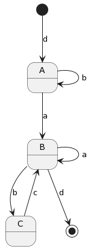

# LFAF Laboratory Work #1

### Course: Formal Languages & Finite Automata
### Author: Dumitru Moraru

----

## Theory
Let's talk about what's going on really fast, ok? \
I understand that IF somebody reads this, he or she
doesn't have a lot of time, so let's dig right in.

What I understood from this?

Essentials:
- Non-terminals are things that are used to derive into other piece of 
text, and they show that it is never the end. (e.g. A, B, C)
- Terminals on the other hand, show that it ends here, and can't go any
further (e.g. a, b, c)

Grammar:
- It needs a list of Terminals
- Non-terminals
- Productions (rules by how the non-terminals are converted into other
non-terminals and terminals)
- Starting symbol, usually "S"

Finite Automata:
- My first association with this concept, was with the "Cellular Automata"
so it helps me understand why we need it. As in Cellular Automata, the
string lives its own life, evolving (maybe?) and going through different
states, until it gets somewhere.. or dies.
- Also, **fun fact**, I've learned that FA can only be done with Type 3 
Regular Grammar.
- It needs Q -> set of possible states
- Sigma -> input alphabet
- q0 -> initial state
- F -> final state(s)
- delta -> a function which will make the transition of states

_Seems easy, right?_

## Objectives:

* Populate the class `Grammar` and `FiniteAutomata`
* Implement the `generate_string()` method in the `Grammar` class
* Implement the `stringBelongToLanguage(final String input_string)`
method in the `FiniteAutomata` class
* Implement the `toFiniteAutomaton()` method in the `Grammar` class
* Understand the basic concepts of Formal Languages and Finite Automata
* Make a diagram of the Finite Automata
* Be happy in life?


## Implementation description

* I've decided to store the production in the form of a HashMap
as it allowed me to link a `Character` to a list of `String`s
```
final HashMap<Character, List<String>> productions;
```
```
productions.put('S', List.of("dA"));
productions.put('A', List.of("aB", "bA"));
productions.put('B', List.of("bC", "aB", "d."));
productions.put('C', List.of("cB"));
```

* How the random `String` is generated? Good question my fellow reader.
Basically, we start from the prompt `S`, and then we go further by
selecting the rules it leads to, in a chain. Something like:
`S -> dA -> dbA -> dbaB -> dbad`

* When having to decide which rule to use next (as a non-terminal)
could have several rules to go further, I've decided to use the
power of `Random`
```
String next_rule = result.get(rand.nextInt(result.size()));
```

* How I saw my finite automata, and decided how it should work? \
 \
This picture allowed me to visualize how everything should work.
Basically we received a word as input, and we go through each
letter (symbol) and try go get to the final state, without
any errors. So if we received an input as `aboba`, we analyze
the word letter by letter, and try to apply each symbol as
a parameter to the current state.
```
current_state = applyRule(current_state, current_letter);
```
* If somewhere we receive
an error, that means the word doesn't belong to the provided
`Grammar`, otherwise it does.
```
// If we received a terminal symbol at the end, that means
// the check was successful.
if (final_state.contains(current_state)) { // terminal string
    return true;
}
// In other case, we got an error.
return false;
```

* How to get from a `Grammar` to a `FiniteAutomata` class? Just by
theory, the list of non-terminals is the `Q (Set of possible states`,
the list of terminals is the `Sigma (Input alphabet)`, but the
`production` rules remain the same.
```
FiniteAutomaton newAutomaton = new FiniteAutomaton(this.V_n, this.V_t, this.productions);
```


## Conclusions / Screenshots / Results

### Opinion:

It was a moderate challenge laboratory work, which
I had fun working on. It is always nice to try something that
you learn in theory, and do it in practice.

My rating for this Laboratory work is: **10/10**

### Results:

#### Word generation:

```
String word = grammar.generate_string();
System.out.println("Final word is: " + word);
System.out.println("Final word is: " + grammar.generate_string());
System.out.println("Final word is: " + grammar.generate_string());
System.out.println("Final word is: " + grammar.generate_string());
System.out.println("Final word is: " + grammar.generate_string());
```
```
Final word is: dbbaad
Final word is: dbad
Final word is: dabcbcd
Final word is: dad
Final word is: dbabcd
```

#### Is string from grammar?
```
System.out.println("Word is from grammar: " + automaton.string_belongs_to_language(word));
System.out.println("Word is from grammar: " + automaton.string_belongs_to_language(word + 'd'));
```
```
Word is from grammar: true
Word is from grammar: false
```

#### Test converting from `Grammar` to `FiniteAutomata`
```
System.out.println(grammar.toFiniteAutomaton().string_belongs_to_language("dad"));
```
```
true
```

## References

_**Books:** Władysław Homenda, Witold Pedrycz \
Automata Theory and Formal Languages_