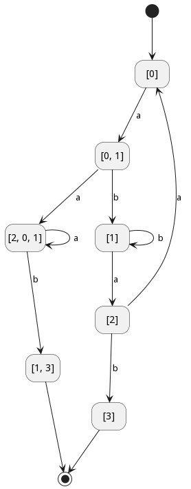

# LFAF Laboratory Work #2

### Course: Formal Languages & Finite Automata
### Author: Dumitru Moraru

----

## Theory
_Only theoreritical knowledge and my sanity were my guides through
this dungeon of  darkness, named "Limbaje Formale & Automate Finite"._

The 4 (or 3, if you prefer) types of Grammar are:

* Type 3 -> Regular grammar
* Type 2 -> Context-free grammar
* Type 1 -> Context-sensitive grammar
* Type 0 -> Unrestricted grammar

Steps for converting NFA to DFA:

* **Step 1:** Initially Q' = ϕ
* **Step 2:** Add q0 of NFA to Q'. Then find the transitions
from this start state.
* **Step 3:** In Q', find the possible set of states for each
input symbol. If this set of states is not in Q', then add it to Q'.
* **Step 4:** In DFA, the final state will be all the states
which contain F(final states of NFA)

## Objectives:

* Understand what an automaton is and what it can be used for.
* Maintain mental well-being.
* Provide a function in your grammar type/class that could
classify the grammar based on Chomsky hierarchy `classify_grammar()`.
* Implement conversion of a finite automaton to a regular
grammar `to_regular_grammar()`.
* Determine whether your FA is deterministic or non-deterministic. \
  (**Spoiler alert**: It is _not_)
* Implement some functionality that would convert an NDFA to a DFA.
`nfa_to_dfa()`.
* Represent the finite automaton graphically.


## Implementation description

* My `classify_grammar()` function works on a basis, that it runs
tests on my Grammar, according to the Chomsky's classification
of Grammar. So a Type 3 should only have the production `Y -> aY` or `Y -> X`.
And so on and so forth for all types.
* My `to_regular_grammar()` function converts all variables from Finite Automata
format to Grammar format, meaning all rules turn in productions, possible states
in V_n, sigma in V_t.
* My `nfa_to_dfa()` function receives a non-deterministic finite automata
a turns into a deterministic finite automata by generating an empty list,
starting with the initial state, then it applies each rule, one by one
and in case we can go in different states, it adds them up in a list. Therefore,
we make an accurate image of a deterministic automata, where we can be in
two states in the same time.
* I represented the finite automata graphically using `PlantUML`. By research,
I found out I can easily connect their `.jar` file to my project, so when function
`to_png()` is called, it generates input for my `PlantUML` program. It creates a
state diagram, where each state is connected via lines. In the final, the file
`finite_automata.png` is created in the project files folder. For example,
you can see the `PlantUML` diagram, for my variant below:



## Conclusions / Screenshots / Results

### Opinion:

It was a great laboratory work to make. I spent countless hours fixing up
bugs and trying to understand why the hell is it not working as I want it
to, but I enjoyed it. It was challenging, but rewarding experience, which
surely enriched my skills. Also spent countless hours rewriting my code,
so it will cover more scenarios.

### Results:

#### NFA to DFA

```
// NDFA to DFA example
List<Character> possible_states = new ArrayList<>(); // Possible states -> Q

possible_states.add('0');
possible_states.add('1');
possible_states.add('2');
possible_states.add('3');

List<Character> sigma = new ArrayList<>(); // Sigma

sigma.add('a');
sigma.add('b');
sigma.add('c');

HashMap<Character, List<String>> rules = new HashMap<>();

rules.put('0', List.of("a0", "a1"));
rules.put('1', List.of("b1", "a2"));
rules.put('2', List.of("b3", "a0"));

FiniteAutomaton my_automaton = new FiniteAutomaton(possible_states, sigma, rules, '0', List.of('3'));

System.out.println("Before: " + my_automaton.rules);

FiniteAutomaton my_dfa_automaton = my_automaton.nfa_to_dfa();

System.out.println("After: " + my_dfa_automaton.rules);
```

#### Output:
```
Before: {[1]=[b1, a2], [2]=[b3, a0], [0]=[a0, a1]}
After: {[1]=[a2, b1], [2]=[a0, b3], [0, 1]=[a201, b1], [2, 0, 1]=[a201, b13], [0]=[a01]}
```

#### Grammar classification

```
HashMap<List<Character>, List<String>> productions2 = new HashMap<>();

productions2.put(List.of('S'), List.of("XaX"));
productions2.put(List.of('X'), List.of("a", "aX", "abc", "λ"));

List<Character> V_n2 = new ArrayList<>(Arrays.asList('S', 'X'));
List<Character> V_t2 = List.of('a', 'b', 'c', 'λ');

Grammar grammar2 = new Grammar(V_n2, V_t2, productions2);

System.out.println("Grammar type is " + grammar2.classify_grammar());
System.out.println("Final word is: " + grammar2.generate_string());
```

#### Output

```
Grammar type is 2
Final word is: abcaabc
```


## References

_**Books:**_
* _Władysław Homenda, Witold Pedrycz_ \
**Automata Theory and Formal Languages**

**Websites:**

* UML Diagrams from code **[PlantUML](https://plantuml.com/state-diagram)**.
* Chomsky Classification of Grammars **[here](https://www.tutorialspoint.com/automata_theory/chomsky_classification_of_grammars.htm)**

### P.S. 

_Sorry for the delay. I wanted to polish my code, so it would work flawlessly,
but I over-appreciated myself._